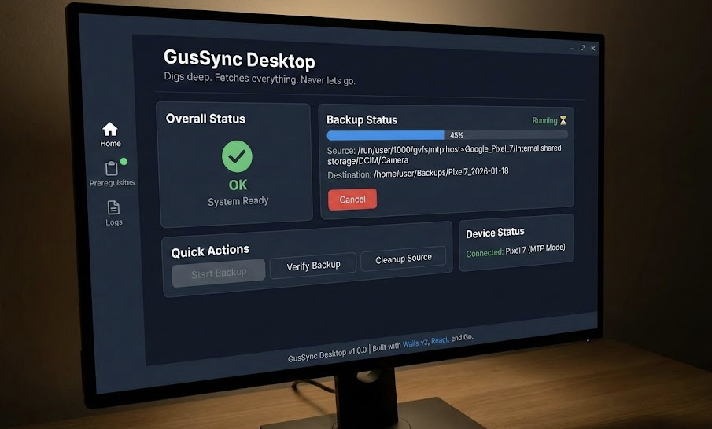

<div align="center">
  

  
</div>

# GusSync Desktop UI

**"Digs deep. Fetches everything. Never lets go."**

A beautiful, modern desktop application for backing up Android phones on Linux. No more command-line complexity, no more fighting with fragile MTP filesystems.

---

## The Frustration

### The Problem We're Solving

You've tried backing up your Android phone on Linux. You know the pain:

- **File managers freeze** - Nautilus, Nemo, or your favorite file manager tries to "prepare" the copy for 20 minutes, then times out
- **MTP is fragile** - The connection drops mid-copy, leaving you with partial backups and no way to resume
- **No progress visibility** - You have no idea if it's working, stuck, or dead
- **Command-line complexity** - The CLI tools work, but you need to remember flags, paths, and commands
- **No way to cancel** - Once started, you're stuck waiting or force-killing processes
- **Lost progress** - If something fails, you start over from scratch

**GusSync Desktop solves all of this.**

---

## What GusSync Desktop Offers

### 🎯 **One-Click Backup**
- Click "Start Backup" → Choose destination → Done
- No command-line flags to remember
- No path guessing or manual device detection

### 📊 **Real-Time Status**
- See exactly what's happening with live status updates
- Know when backup is running, completed, or failed
- Visual feedback with color-coded status indicators

### 🛑 **Full Control**
- Cancel backup anytime with a single click
- No more force-killing processes or waiting helplessly
- Graceful cancellation that cleans up properly

### 🔄 **Resumable Backups**
- If something fails, just click "Start Backup" again
- GusSync remembers what it already copied
- Automatically resumes from where it left off
- No wasted time re-copying files

### ✅ **Prerequisites Check**
- Automatic system checks before backup
- Clear warnings about missing dependencies
- One-click navigation to fix issues
- No more "command not found" surprises

### 📁 **Smart Path Management**
- Auto-detects your connected Android device
- Remembers your backup destination
- Easy destination selection with file picker
- Shows source and destination paths clearly

### 🎨 **Modern, Clean Interface**
- Dark theme optimized for long backup sessions
- Clear visual hierarchy
- Status badges and icons for quick understanding
- Responsive layout that works on any screen

---

## How to Use GusSync Desktop

### First Time Setup

1. **Install Prerequisites**
   - The app will check automatically
   - If anything is missing, go to the Prerequisites page
   - Follow the instructions to install required tools

2. **Connect Your Phone**
   - Connect your Android phone via USB
   - Enable USB file transfer mode (MTP) on your phone
   - The app will auto-detect your device

3. **Choose Backup Destination**
   - Click "Choose Destination" button
   - Select where you want backups saved
   - This path is remembered for future backups

### Starting a Backup

1. **Check Prerequisites** (if needed)
   - Look at the "Overall Status" card
   - Green badge = ready to go
   - Red badge = fix issues first (click to see what's wrong)

2. **Start Backup**
   - Click "Start Backup" button
   - If no destination is set, you'll be prompted to choose one
   - The backup starts automatically

3. **Monitor Progress**
   - Watch the "Backup Status" card for updates
   - See source and destination paths
   - Status updates in real-time:
     - ⏳ **Running** - Backup in progress
     - ✅ **Completed** - All files copied successfully
     - ❌ **Failed** - Something went wrong (check error message)
     - ⏹️ **Cancelled** - You stopped the backup

4. **Cancel if Needed**
   - Click "Cancel" button anytime during backup
   - The process stops gracefully
   - You can start again later (it will resume)

### After Backup

- **Verify Backup** - Check that files copied correctly (coming soon)
- **Cleanup Source** - Remove files from phone after backup (coming soon)
- **View Logs** - Check the Logs page for detailed information

---

## Features in Detail

### Prerequisites Management

The app automatically checks your system for:
- Required command-line tools (adb, gvfs, etc.)
- Device connectivity
- File system permissions
- Storage availability

**Status Indicators:**
- 🟢 **OK** - Everything ready
- 🟡 **WARN** - Minor issues, but can proceed
- 🔴 **FAIL** - Critical issues, must fix before backup

Click on any failed check to see how to fix it.

### Backup Status Display

The backup status card shows:
- **Current State** - Running, Completed, Failed, or Cancelled
- **Status Message** - What's happening right now
- **Source Path** - Where files are being copied from
- **Destination Path** - Where files are being saved
- **Cancel Button** - Appears when backup is running

### Smart Resume

GusSync tracks every file it copies in a state file. This means:
- **Interrupted backups resume automatically** - Just click "Start Backup" again
- **No duplicate copies** - Already copied files are skipped
- **Progress preserved** - You never lose work

### Error Handling

- **Clear error messages** - No cryptic error codes
- **Error log file** - Detailed logs at `~/.gussync/logs/errors.log`
- **Recovery suggestions** - The app tells you what went wrong and how to fix it

---

## Good UX Principles We Follow

### 1. **Progressive Disclosure**
- Show only what you need, when you need it
- Prerequisites hidden until you need them
- Status details appear as backup progresses

### 2. **Clear Feedback**
- Every action has visual feedback
- Status changes are immediately visible
- Color coding for quick understanding

### 3. **Forgiveness**
- Easy to cancel operations
- Can resume after failures
- No destructive actions without confirmation

### 4. **Discoverability**
- Clear button labels
- Helpful status messages
- Obvious next steps

### 5. **Consistency**
- Same patterns throughout the app
- Predictable behavior
- Familiar UI elements

### 6. **Efficiency**
- Remember your preferences
- Auto-detect common settings
- Minimize clicks to complete tasks

---

## Pages Overview

### Home Page
- **Overall Status** - System health at a glance
- **Backup Status** - Current backup progress (when running)
- **Quick Actions** - Start backup, verify, cleanup
- **Device Status** - Connected device information

### Prerequisites Page
- **System Checks** - All prerequisite checks with status
- **Fix Instructions** - How to resolve each issue
- **Auto-refresh** - Checks update automatically

### Logs Page
- **Application Logs** - Real-time log viewing
- **Error Logs** - Detailed error information
- **Filtering** - Search and filter log entries

---

## Technical Details

### Backup Modes

**Mount Mode (Default)**
- Uses MTP/GVFS filesystem mounts
- Works with standard Linux file managers
- Auto-detects devices in `/run/user/$UID/gvfs/`

**ADB Mode** (coming soon)
- Uses Android Debug Bridge
- More reliable for large backups
- Requires USB debugging enabled

### State Management

GusSync maintains a state file (`gus_state.md`) that tracks:
- ✅ Completed files (with hash verification)
- ❌ Failed files (with retry counts)
- 📁 Directory scan status
- 🔄 Resume points

This file is human-readable and can be edited if needed.

### Error Logging

All errors are logged to:
- **Error Log**: `~/.gussync/logs/errors.log`
- **Application Log**: View in the Logs page
- **Wails Dev Log**: `.wails-dev.log` (development only)

---

## Troubleshooting

### Backup Won't Start

1. **Check Prerequisites** - Go to Prerequisites page
2. **Check Device Connection** - Ensure phone is connected and in MTP mode
3. **Check Destination** - Make sure destination path is writable
4. **Check Logs** - View error log for details

### Backup Keeps Failing

1. **Check Error Messages** - Read the error in the status card
2. **Check Error Log** - `tail -f ~/.gussync/logs/errors.log`
3. **Try Different Mode** - Switch between mount/ADB mode
4. **Check Connection** - USB cable, port, or try different port

### UI Not Updating

1. **Restart App** - Close and reopen the window
2. **Check Console** - Open browser dev tools (F12) for errors
3. **Reload** - Run `./scripts/reload.sh` to rebuild

---

## Development

### Running in Development

```bash
./scripts/reload.sh
```

This script:
- Clears caches and old builds
- Rebuilds frontend
- Kills old processes
- Starts wails dev with correct configuration

### Building for Production

```bash
wails build
```

Creates a standalone binary in `build/bin/`.

---

## Why GusSync is Different

### Traditional File Managers
- ❌ Try to enumerate entire tree before copying
- ❌ Freeze on large directories
- ❌ No resume capability
- ❌ No progress tracking

### GusSync Desktop
- ✅ Starts copying immediately
- ✅ Handles large directories gracefully
- ✅ Automatic resume on restart
- ✅ Real-time progress and status
- ✅ Beautiful, intuitive interface
- ✅ One-click operations

---

## Getting Help

- **Check Logs** - Most issues are logged with helpful messages
- **Prerequisites Page** - Fixes for common setup issues
- **Error Messages** - Read the status card for specific errors

---

## License & Credits

GusSync Desktop - Built with Wails v2, React, and Go.

**"Digs deep. Fetches everything. Never lets go."**

